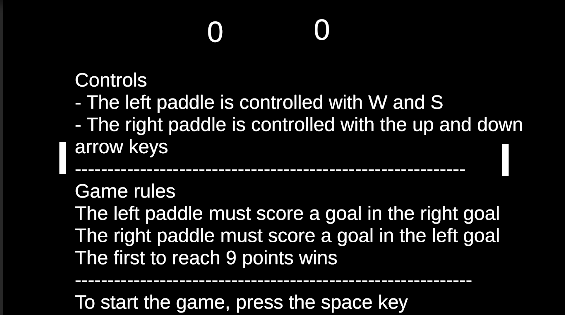
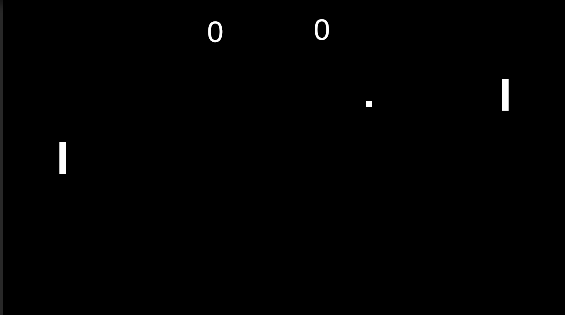
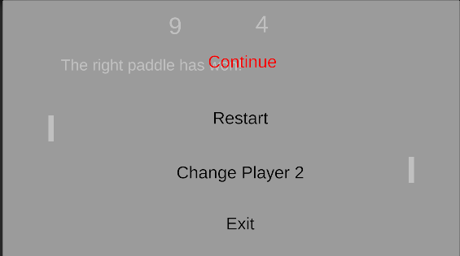

# Manual de usuario

## Escenario

Se empieza con la siguiente pantalla con las 2 paletas y el marcador a 0-0.

En el centro se muestran las imagenes con las reglas de juego e instrucciones del juego, como moverse y empezar a jugar.

## Juego iniciado

Saldra una pelota cuadra hacia la derecha o izquierda variando su posición inicial de salida de forma completamente aleatoria.

El objetivo consiste en evitar que la pelota entre en tu poteria (lado) usando la pala para que rebote y no lo haga. Si lo hace tu rival suma un punto a su favor.

## Menu pausa

El menu de pausa se puede acceder pulsando la tecla ESC. Desde el menu de pausa se puede reanudar el juego, reiniciarlo, cambiar el tipo de segundo jugador (ordenador o humano) o salir del juego.

